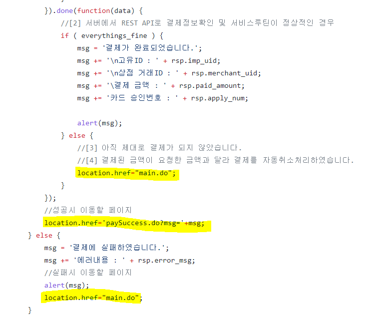

## :pushpin: kajahotel
>호텔 예약 서비스         

 

### 1.제작기간&참여 인원
* 2022.12.28 ~ 2023.01.06
* 팀프로젝트(5명)

 

### 2.사용기술
* JAVA11   
* ORACLE   
* SPRING FRAMEWORK   
* JAVASCRIPT   
* AJAX   
* 아임포트결제 API   
* KAKAO 지도API      
* Jsp

 

### 3.ERD

    

### 4.프로젝트 영상   

https://github.com/Seoha95/kajahotel/assets/107228582/cf477554-74c6-430d-9a7c-b221e0aba78b   

    

### 4.핵심기능
 * 사용자는 회원가입 및 로그인, 회원탈퇴 기능 : 비회원 일 경우 회원가입을 하고 로그인 및 회원탈퇴를 할 수 있습니다.   
 * 원하는 지역의 호텔 선택 및 예약 기능: 사용자는 체크인, 체크아웃 날짜와 인원수를 선택한 후, 원하는 지역과 호텔을 선택하여 예약할 수 있습니다.    
   이 기능은 사용자가 원하는 지역에서 호텔을 찾고 예약하는 핵심 기능으로 편리한 호텔 예약을 가능하게 해줍니다.
 * 고객의 소리 남기기 기능: 사용자는 고객의 소리를 남길 수 있습니다. 이 기능을 통해 사용자는 자신의 경험을 공유하거나 호텔에 대한 의견을 작성할 수 있습니다.   
   이는 다른 사용자들에게 호텔 선택에 도움을 주고 서비스의 개선에 기여할 수 있습니다.    
 * 관리자로 로그인하여 회원정보, 예약정보, 고객의 소리를 수정하는 기능: 관리자로 로그인한 경우, 회원정보, 예약정보, 고객의 소리를 수정할 수 있습니다.    
   이 기능은 관리자가 시스템의 관리와 운영을 원활하게 할 수 있도록 도와줍니다.  
   

핵심기능설명펼치기
   
   
#### 4-1. 사용자의 입력  
 * 회원가입 기능 📍[코드확인](https://github.com/Seoha95/kajahotel/blob/e9b19b276a8cbbc03c0be2da7ec92112ded7c2b2/src/main/webapp/WEB-INF/views/join.jsp#L14-L70)
  * 사용자 등록 : 회원가입 페이지를 통해 사용자의 기본 정보(이름, 이메일, 비밀번호, 비밀번호 재확인, 전화번호)를
    입력받아 회원으로 등록합니다.
  * 유효성 검사 : 회원가입 시 비밀번호가 8자 이상이면서 숫자, 대문자, 소문자, 특수문자가 포함하지 않을 경우 안내문구를
    띄웁니다.      
 * 로그인 기능  📍[코드확인](https://github.com/Seoha95/kajahotel/blob/e9b19b276a8cbbc03c0be2da7ec92112ded7c2b2/src/main/webapp/WEB-INF/views/login.jsp#L30-L34)
  * 사용자 인증 : 로그인 페이지를 통해 사용자의 이메일과 비밀번호를 입력받아 인증합니다.
* 회원 탈퇴 기능 📍[코드확인](https://github.com/Seoha95/kajahotel/blob/e9b19b276a8cbbc03c0be2da7ec92112ded7c2b2/src/main/webapp/WEB-INF/views/userDelete.jsp#L30-L36)
 * 회원 확인 후 탈퇴 : 이메일과 비밀번호 입력 후 2개의 데이터가 일치하는 데이터가 있으면 회원 정보가 삭제됩니다.
* 고객의 소리 등록 기능 📍[코드확인](https://github.com/Seoha95/kajahotel/blob/e9b19b276a8cbbc03c0be2da7ec92112ded7c2b2/src/main/webapp/WEB-INF/views/reviewWriting.jsp#L32-L47)
 * 호텔 이용 후 리뷰 작성 : 사용자가 로그인 후 고객의 소리를 클릭하면 제목과 내용을 입력하고 등록할 수 있습니다.     

### 4-2. 사용자의 선택   
 * 원하는 기간과 인원수를 예약하는 기능 📍[코드확인](https://github.com/Seoha95/kajahotel/blob/e9b19b276a8cbbc03c0be2da7ec92112ded7c2b2/src/main/webapp/WEB-INF/views/reservation.jsp#L39-L72)
  * 로그인 한 후에 메뉴의 예약을 클릭하고 원하는 날짜의 체크인과 체크아웃을 선택할  수 있습니다.
  * 인원수도 지정할 수 있습니다.    

### 4-3. 관리자의 수정   
 * 예약 정보 수정 기능 📍[코드확인](https://github.com/Seoha95/kajahotel/blob/e9b19b276a8cbbc03c0be2da7ec92112ded7c2b2/src/main/webapp/WEB-INF/views/adminReservationInfo.jsp#L27-L47)
  * 회원의 예약정보를 수정할 수 있습니다.
* 회원정보 수정 기능 📍[코드확인](https://github.com/Seoha95/kajahotel/blob/e9b19b276a8cbbc03c0be2da7ec92112ded7c2b2/src/main/webapp/WEB-INF/views/adminUserInfo.jsp#L27-L50)
 * 회원의 기본정보(이름, 이메일, 전화번호, 비밀번호)를 수정할 수 있습니다.    
    
#### 4-4. MyBatis를 활용한 호텔 예약 서비스
 * dao 대신에 Mapper를 활용한 데이터 조인 구현 📍[코드확인](https://github.com/Seoha95/kajahotel/blob/e0da15589141e645d9561cfcb44a15ebe679076e/src/main/resources/mapper/Join.xml#L5-L61)   
   

   
      
 

### 5.핵심 트러블 슈팅    
    
#### 5-1. 결제 성공이나 실패시 페이지 이동 문제   
결제 중에 결제창을 닫았을 때는 실패페이지로 넘어가고 결제가 성공적으로 완료될 경우 성공페이지로   
넘어가야하는데 계속해서 성공페이지만 보여주거나 실패페이지만 보여주는 문제가 있었습니다.   
그래서 문제가 되는 부분을 코드를 고쳐 개선했습니다.   
           
   

      

해결한 코드
   
     
        

        
    
### 6. 느낀점   
Spring MVC를 사용하여 코드를 더 간결하게 작성하고, MyBatis를 도입한 이후에는 DAO에서 SQL 문을 사용하여    
조인을 수행하던 것과 달리, ResultMap을 활용하여 조인을 간편하게 처리할 수 있었습니다. 이를 통해 DAO에 비해    
더 편리하게 개발할 수 있었습니다.    

