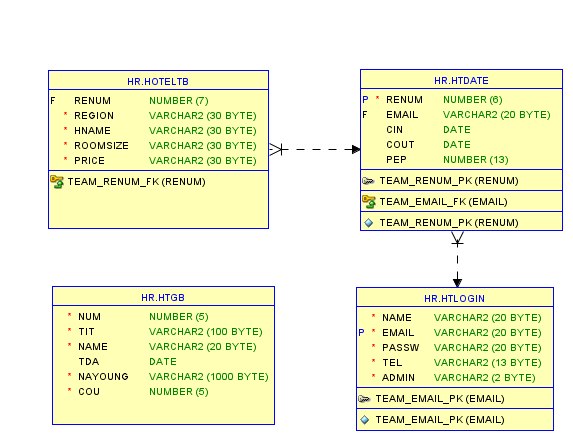

## :pushpin: kajahotel
>호텔 예약 서비스   

 

### 1.제작기간&참여 인원
* 2022.12.28 ~ 2023.01.06
* 팀프로젝트(5명)

 

### 2.사용기술
* JAVA11   
* ORACLE   
* SPRING FRAMEWORK   
* JAVASCRIPT   
* AJAX   
* 아임포트결제 API   
* KAKAO 지도API   
* CSS   
* Jsp

 

### 3.ERD

 

### 4.핵심기능
이 서비스의 핵심기능은 원하는 지역의 호텔을 선택해서 예약을 하는 것입니다.   
사용자가 체크인, 체크아웃, 인원수를 정하고 원하는 지역과 호텔을 선택해서 예약할 수 있습니다.   
사용자는 고객의 소리에 글을 남길 수 있습니다.    
관리자로 로그인할 경우 회원정보, 예약정보, 고객의 소리를 수정할 수 있습니다.   
   

핵심기능설명펼치기
   
   
#### 4-1. 사용자 시퀀스다이어그램   
   
   
   
#### 4-2. 관리자 시퀀스다이어그램  
   
    
    
#### 4-3. Mapper를 이용   
 * dao 대신에 Mapper이용해서 join 구현 [코드보기](https://github.com/Seoha95/kajahotel/blob/main/src/main/resources/mapper/Join.xml#:~:text=%3C%3Fxml%20version,Give%20feedback)   
   

   
      
 

### 5.핵심 트러블 슈팅    
    
#### 5-1. 결제 성공이나 실패시 페이지 이동 문제   
결제 중에 결제창을 닫았을 때는 실패페이지로 넘어가고 결제가 성공적으로 완료될 경우 성공페이지로   
넘어가야하는데 계속해서 성공페이지만 보여주거나 실패페이지만 보여주는 문제가 있었습니다.   
그래서 문제가 되는 부분을 코드를 고쳐 개선했습니다.   
        

      

기존코드
     
     

    
   

      

개선된 코드
   
           

        
    
### 6. 느낀점

